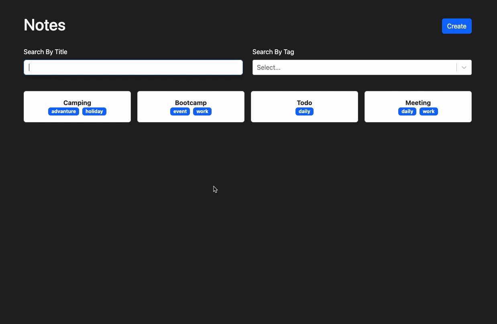
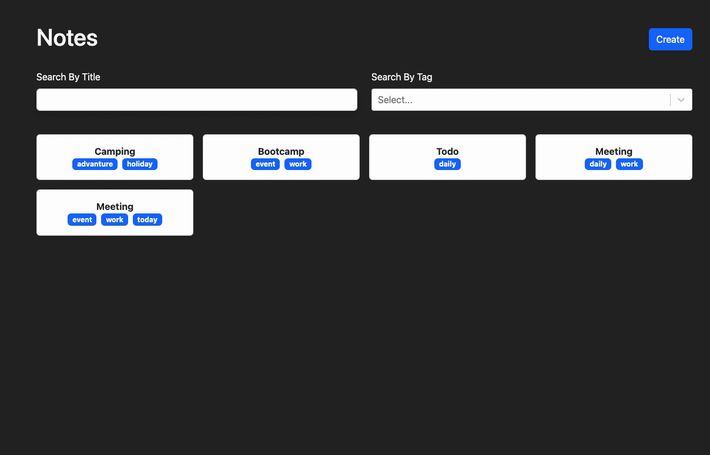

# <h1>TypeScript-Note-App</h1>

 This note application performs CRUD operations such as creating, editing and deleting notes. The application designed to be fully responsive.

<h2> Programming Languages Used</h2>

Website is coded with JSX CSS/BOOTSTRAP & REACT.JS &TYPESCRIPT

# Librarys
- react-Router-dom
- react-markdown
- react-select
- react-bootstrap
- useHooks (useLocalStorage)

<h2>Screen </h2>

